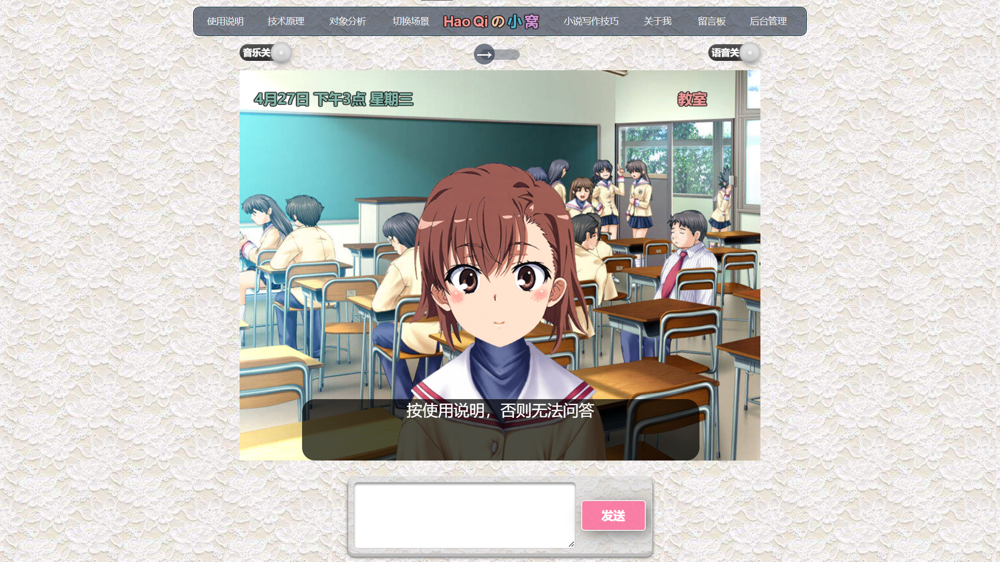

<br />
<p align="center">
    
  </a>
  <h2 align="center" style="font-weight: 600">HaoQiの小窝</h2>

  <p align="center">
    高颜值的智能问答机器人
    <br />
    <a href="https://" target="blank"><strong>🌎 访问DEMO</strong></a>&nbsp;&nbsp;|&nbsp;&nbsp;
    <a href="https://haoqiyun.ml" target="blank"><strong>💬 个人博客</strong></a>
    <br />
    <br />
  </p>

</p>

**演示** 

## ✨ 特性

- ✅ 使用 sql语言
- 🔴 个性化定制
- 🛠 更多特性开发中

## 📦️ 安装

####  :computer: 运行环境

运行需要mysql数据库和php运行环境（例如AppServ）。

新建数据库，把snow.sql导入数据库，字符集设utf8，排序规则设utf8_general_ci

config配置文件改成你的信息，就可以运行了。

#### 👷‍♂️搭建php运行环境：

第一步：安装AppServ。安装时，出现4个组件的选择安装，把MySql Database的钩去掉，就是不要安装，否则会覆盖已安装的mysql数据库。mysql数据库应另外单独安装，用不着通过AppServ方式安装。

第二步：把网页程序文件，都放到C盘的AppServ文件夹里的www文件夹里。

第三步：浏览器网址栏输入localhost/index.html就可以打开网页主页了。

最好在www文件夹下，再建立一个文件夹，例如叫a。网页文件都放入a文件夹，那么网址就是localhost/a/index.html

#### ☑️安装mysql数据库：

第一步：安装mysql数据库

第二步：安装navicat或workbench，就是mysql的可视化界面

第三步：建立数据库，把snow.sql导入进去。新建数据库时，字符集选择utf8，排序规则选择utf8_general_ci


## ⚙️ 部署到自己的服务器

除了部署到 Vercel，你还可以部署到自己的服务器上，一般选择轻量级的操作系统centOS。

1. 克隆本仓库

```sh
git clone https://github.com/haoqi7/chatrobot.git
```

  2.宝塔面板，新建网站。

 3.上传网站代码至服务器,导入数据库。

## 📜 开源许可

本项目由大佬开源支持，[开源网址](http://hojer.cn/)

大佬の[哔哩哔哩](https://tieba.baidu.com/home/main?un=%E6%9A%AE%E6%9C%A8%E5%A4%95%E6%BA%AA)

### 打赏赞助

​    

